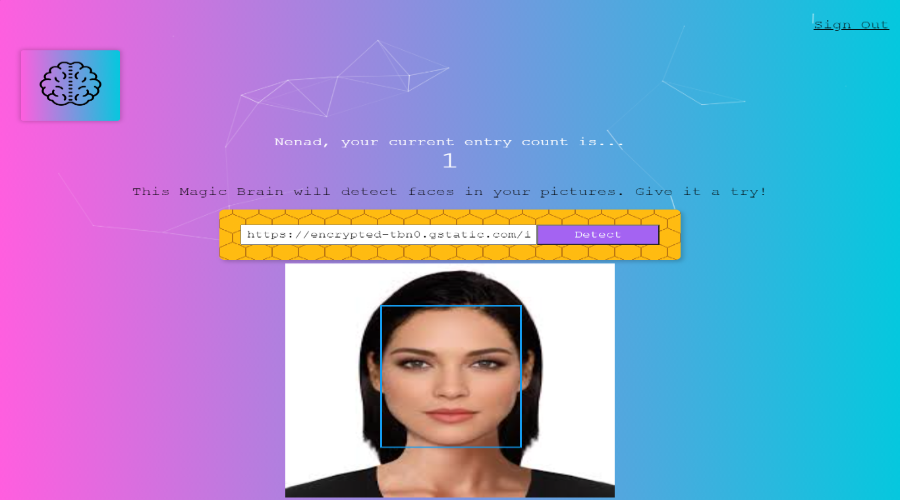

# smart-brain
Smart Brain is a web app that uses the Clarifai API to locate a face in a picture. Using a React.js front-end and Node.js backend with Express.js as well as a PosrtgreSQL database to keep track of how many entries every user has made.

## Technologies Used

### Front-End
- HTML5
- CSS3
 - React.js

### NPM Packages
- Create-React-App
- Tachyons
- react-tilt
- particles.js
- Bcrypt
- Postgresql
- knex
- body parser
- cors
- express

### APIs
- [Clarifai](https://www.clarifai.com/)
- [Smart Brain API](https://github.com/Nenad984/smart-brain-api)

[screen-capture.webm](https://user-images.githubusercontent.com/43686522/196205402-5c17ac5a-f1f5-44f9-aa23-32e4185e6f45.webm)

